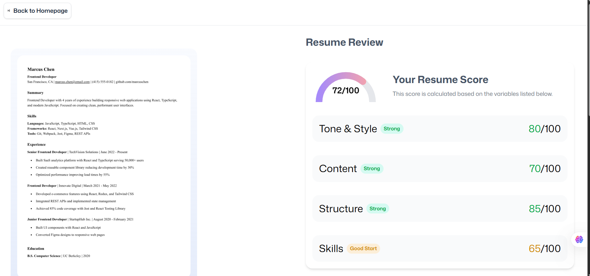

# AI Resume Analyzer

A lightweight web app that scores and reviews your resume for a specific job. Upload a PDF, add the job context, and get instant ATS-style feedback with suggestions for tone & style, content, structure, and skills.

## Preview



## Tech Stack

- React 19 + React Router 7 (SPA + Data APIs)
- TypeScript
- Tailwind CSS 4
- Vite 7
- Zustand (state management)
- react-dropzone (file upload)
- pdfjs-dist (PDF to image processing)

## Features

- Upload a resume PDF and convert it to an image preview.
- Provide company name, job title, and job description for context-aware analysis.
- Get structured feedback and an overall score similar to ATS systems.
- Clean UI with responsive styles.
- Modern DX with HMR and type-safe routes.

## Folder Structure

```
ai-resume-analyzer/
├─ app/                     # Application source (routes, UI, logic)
│  ├─ components/           # Reusable UI components
│  │  ├─ FileUploader.tsx
│  │  └─ ResumeCard.tsx
│  ├─ constants/            # Static configuration/instructions
│  ├─ routes/               # Route modules (pages)
│  │  ├─ home.tsx
│  │  ├─ upload.tsx
│  │  ├─ auth.tsx
│  │  └─ wipe.tsx
│  ├─ app.css               # Global styles
│  └─ routes.ts             # Router config helpers
├─ public/
│  └─ images/               # Static images (served at /images)
│     └─ preview.png
├─ types/                   # Shared TypeScript types
├─ react-router.config.ts   # React Router config
├─ vite.config.ts           # Vite configuration
├─ package.json
└─ tsconfig.json
```

## Quick Start

1) Install dependencies

```bash
npm install
```

2) Run the dev server

```bash
npm run dev
```

3) Open the app

Visit `http://localhost:5173`, go to the upload page, add job details, and drop a PDF resume to analyze.

